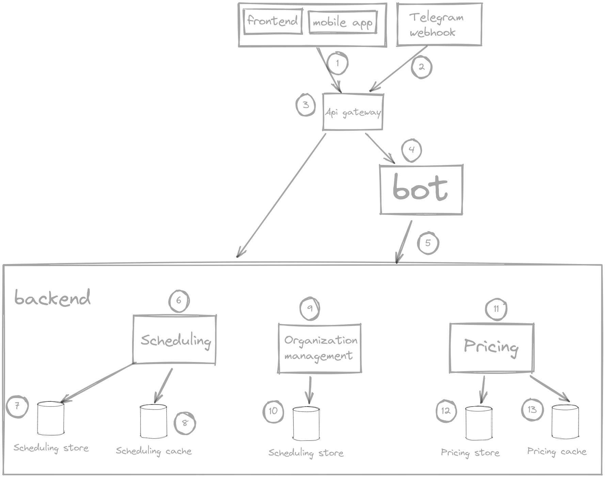

# Домашняя работа №8
💎 Спроектировать систему (написать примерно 1-2 абзаца в README.md)

Взять часть любой существующей системы (например, комментарии на YouTube, лента новостей в Twitter и т.д. что вам нравится) и описать, как бы вы ее спроектировали и почему именно так.
- Ответить как минимум на следующие вопросы:
- Кто потребители системы?
- Какие свойства критически важны для этой системы, а какие не очень?
- В зависимости от установленных приоритетных свойств описать:
    - Какие будут сервисы, на чем они будет написаны, что будут делать и как будут масштабированы?
    - Какие будут системы хранения данных, что будут хранить и как будут масштабированы?
    - Какие еще компоненты системы следует реализовать и почему (LB, RL и т.д.)?
- Нарисовать схему или описать, как это все будет друг с другом взаимодействовать.

## Сервис для бронирования репетиций

У меня есть пет проект, я им когда-то занимался и довел до какого-то рабочего состояния, но забросил (https://github.com/RehearsalsBooking)

Он написан на пхп (ларавель), но я давненько хочу переписать его на го, поскольку мне не нравится его архитектура, я ее не особо продумывал, а после "завершения" 
появилось понимание, как его лучше сделать, какие сервисы правильно выделить.

Тут попробую задизайнить его, буду рад фидбеку

### Функциональные требования:
- Управление репетиционной точкой:
  - управление ценами на репетиции, гибкая настройка в зависимости от длительности репетиции, времени и дня недели
  - акции и промокоды
  - управление расписанием репетиционной точки - бронирование репетиций, просмотр свободного времени
- просмотр броней пользователем, напоминания о репетиции
- просмотр цен на репетиции, пользователь выбирает репточку и время, ему показывается цена

### Нефункциональные требования

Проект не сильно амбициозен, ниша относительно небольшая (целевая аудитория - музыканты, играющие в группах, владельцы репетиционных точек)

#### Хранение

Оценим вариант, когда сервис стал популярен во всей стране
 - количество репточек: в моем городе (не миллионник) порядка 10 публичных репетиционных точек. думаю, в большинстве городов порядок такой же 
 - в крупных городах (москва, питер, екатеринбург) их чуть больше, аналитику не проводил, примерный порядок - 100-300 репточек
 - количество городов ~200 (берем крупные и средние города)
 - приблизительное целевое количество репточек = 200\*10 + 10\*100 = 3-4к. округлим до **5к репточек в сервисе**
 - количество репетиций: в среднем репетиция ддлится 1-2ч, в день это 10-15 репетиций в репточке. умножим на количество репточек, получим 15*5000 = 75к репетиций в день. можем округлить до 100к
 - для хранения одной репетиции нужно примерно 30 байт (инфа о времени, репточке, пользователе)
 - в день это будет занимать 30 * 100000 = 3.000.000 = 3 мб. можем округлить до 10мб, не забывая об индексах
 - в год будет тратиться 10мб * 400 = 4000мб = 4гб, можем округлить до **10гб/год**
 - в принципе все влазит в один сервер бд, шардинг вряд ли потребуется

#### RPS

- аналитику не проводил, допустим приложением будет пользоваться 200к пользователей каждый день
- в день каждый пользователь будет 5 раз просматривать расписание 
- в день будет бронироваться 100к репетиций (см выше)
- на запись RPS = 100к/24/60/60 = 2. можем округлить до 5 RPS
- на чтение RPS = 200к*5/24/60/60 = 11. можем округлить до 50 RPS
- итого приложение не будет высоконагруженным, нам вряд ли потребуется горизонтальное масштабирование, один сервер должен выдержать всю нагрузку, сможем обойтись только вертикальным масштабированием

#### Availability

- 99%, можем позволить себе лежать 15м в день

### Схема

1) сайт (спа на вьюжс) и мобильное приложение (скомилированное под мобилки спа) будут обращаться к нашему серверу через хттп
2) будет телеграм-бот, который будет работать через вебхуки. когда боту будут писать, телеграм будет оповещать нащ сервер
3) какая-то единая точка входа в приложение. не обязательно отдельный сервис, поскольку горизонтальное масштабирование не понадобится, но если понадобится - можно будет вынести в отдельный сервис
4) логика для бота. будем делать отвзяанной от апи телеграма (возможно будет бот в вконтакте), логика и флоу чатов, команды
5) бот будет обращяться к нашим сервисам

бекенд планирую делать монолитом, но с слабо связанными сервисами внутри, чтобы по необходимости в будущем вынести сервисы в отдельные микросервисы

как минимум на старте будет одна бд на все сервисы, пока она не станет узким местом

6) сервис расписания. ответственный за свободное время на репточках, бронирование репетиций, брони клиентов
7) хранилище репетиций. стандартные реляционные таблицы в постгресе, для времени репетиций будем 
использовать тип range, который позволяет делать удобные запросы для времени репетиций и определении свободного времени (оверлаппинг периодов) и к тому же индексируется
8) кеш расписания. чтобы снизить нагрузку на бд актуальное расписание можно эффективно кешировать, поскольку оно меняется только при оформлении репетиции или ее отмены
9) сервис для управления репточкой. обычный круд
10) стандартные реляционные таблицы в постгресе
11) сервис цен. ответственный за ценовую политику репточки, вычисление стоимости репетиций
12) стандартные реляционные таблицы в постгресе
13) кеш цен, они не будут часто меняться и их можно будет эффективно кешировать, чтобы не рассчитывать цену на каждый запрос